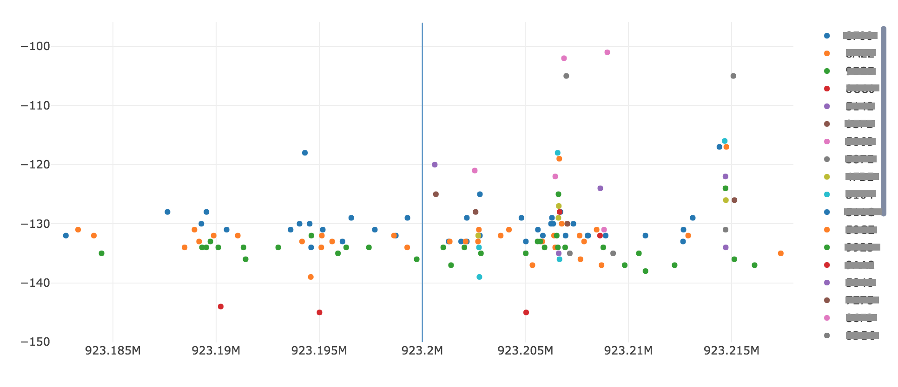

# What for ? 
This is a Jupyter notebook that will ask for a Sigfox Device ID and a Radio Configuration, and the ouput will be a graph with RSSI on Y Axis and Frequency on X Axis. The results are filter between the 2 dates entered. 

# How ? 
* Install Jupyter (have a look at [https://www.anaconda.com/download/]() distribution), 
* Install the necessary library

	conda install plotly

* Create an account on [https://plot.ly/]()
* Modify api.conf with your Sigfox API backend credentials. 

# Results

Here is the kind of graph that you will get: 

